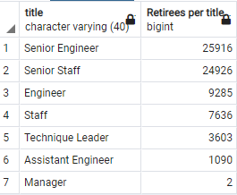

# Pewlett-Hackard-Analysis
Using SQL commands to analyze data in a database

## Overview of the analysis:

This project analyzes the employee database of the Pewlett-Hackard (PH) determine the number of retiring employees per title, and identify employees who are eligible to participate in a mentorship program. 

## **Results:** 

- There is a very large number of employees that will be retiring soon (72,458). This means that the PH will be loosing institutional knowledge.
- Of the 72,458 people retiring, only two hold the "Manager" title. For a company this big, I found that strange and in need of further investigation.
- 
- 1549 employees are eligible for mentorship within the company. The company needs to expand its eligibility criteria to fit more people so institutional knowledge can be passed down to more people
- The titles most impacted by high retirement are "Senior Engineer" and "Senior Staff" but the numbers of people holding the "Engineer" and "Staff" roles is comparatively low. 


## Summary:

 

- 72,458 roles need to be recruited for as soon as possible to reduce the impact of the retirement. 
- As earlier stated the titles most impacted by high retirement are "Senior Engineer" and "Senior Staff" but the numbers of people holding the "Engineer" and "Staff" roles is comparatively low. The company needs to recruit for additional senior employees or expand eligibility for internal mentorship. 

---

Additional queries that may fill in some of the gaps include:

- Breakdown of employees retiring per department, for example:

  ```sql
  -- List of retiring employees in the sales and development departments
  -- Join retirement_info, dept_emp and departments tables
  SELECT ri.emp_no,
  	ri.first_name,
  	ri.last_name,
  	d.dept_name
  FROM retirement_info as ri
  LEFT JOIN dept_emp as de
  ON (de.emp_no = ri.emp_no)
  INNER JOIN departments as d
  ON (de.dept_no = d.dept_no)
  WHERE dept_name IN ('Sales', 'Development');
  ```

- Breakdown of manager information to see why there are so few: 

  ```sql
  -- manager's employee number, first name, last name, 
  -- and their starting and ending employment dates
  -- Joining departments, dept_manage, and current_emp tables
  SELECT dm.dept_no,
  	d.dept_name,
  	dm.emp_no,
  	ce.first_name,
  	ce.last_name,
  	dm.from_date,
  	dm.to_date
  INTO manager_info
  FROM departments as d
  LEFT JOIN dept_manager as dm
  ON (d.dept_no = dm.dept_no)
  INNER JOIN current_emp as ce
  ON (dm.emp_no = ce.emp_no);
  ```

  

## Resources

**Data Sources:** departments.csv, dept_emp.csv, dept_manager.csv, employees.csv, salaries.csv, titles.csv

**Software:** SQL, PostgreSQL, pgAdmin
